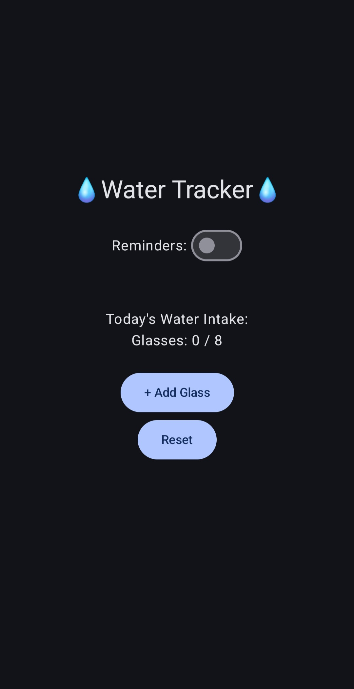
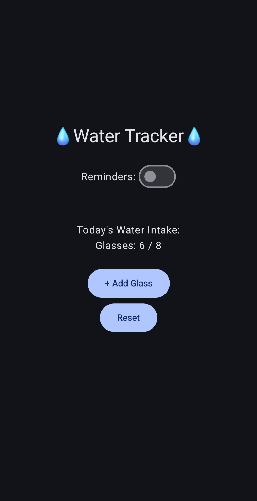
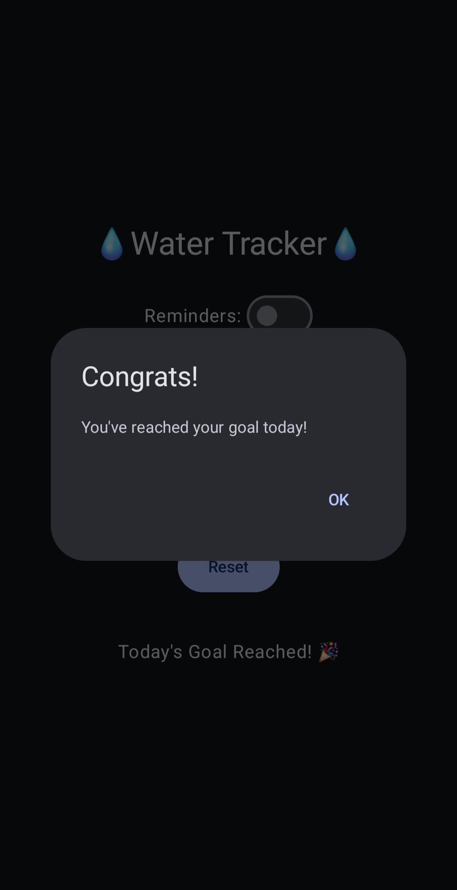
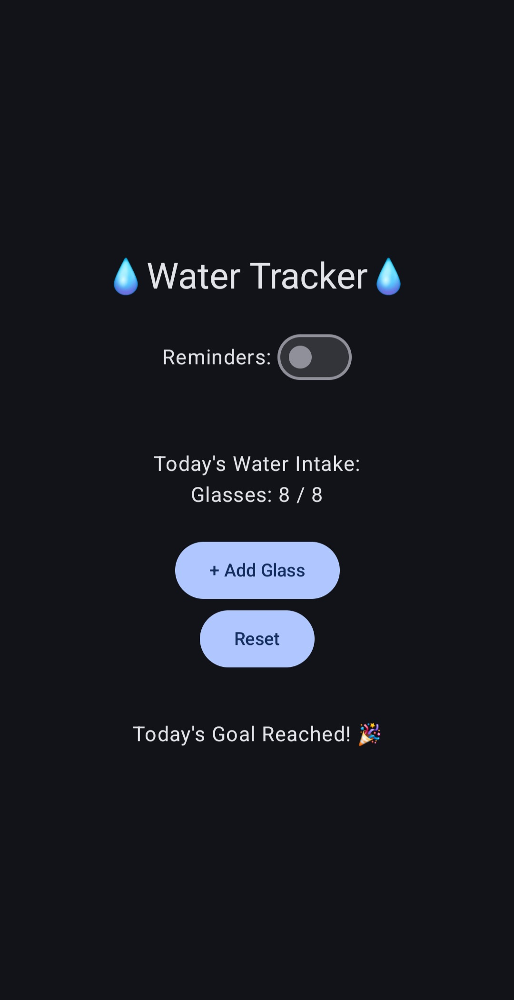
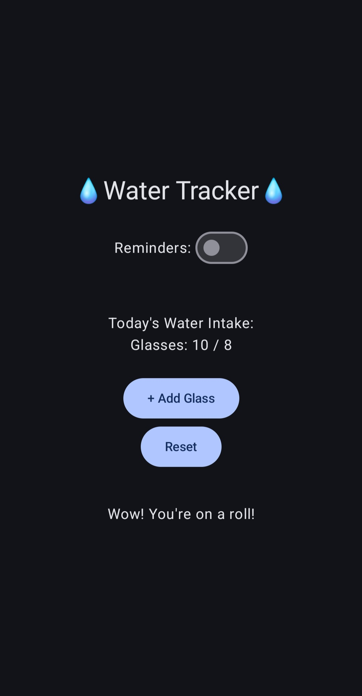

# 💧 Water Tracker App

A simple Android Studio app written in Kotlin that helps track your daily water intake.
- **Minimum SDK:** API 24 (Android 7.0 – Nougat)  
- **Device Coverage:** ~99.2% of Android devices
- **Testing Device:** We used a physical Samsung Galaxy S25 Ultra with a wired connection and an emulator for testing.

### App Screenshots

- Initial state / after reset:  
  

- After pressing the Add Glass button 6 times:  
  

- Goal reached:  
  
  

- Past the goal:  
  

### What makes Compose declarative?
Compose is declarative as it conceptually regenerate the entire screen from scratch when data changes, as opposed to a an imperative model, wherein developers act like a maunal middleman by capturing View objects and issuing explicit commands. 

In this app, we don't manually tell the UI to change, instead, we describe the UI as a function of its current data. When the `glassesCount` changes, Compose triggers **intelligent recomposition**, conceptually regenerating the screen to reflect the new state while skipping any components that haven't changed. This eliminates the "dual-system tax" of jumping between XML layouts and Kotlin logic, allowing the UI to stay perfectly in sync with the underlying data wihtout signficant synchronization logic.

### Where is state stored?
State is stored within the Composable lifecycle using the `remember` and `rememberSaveable` APIs. 

To avoid a fragmented source of truth (which is often common in XML Views), in our app, we use **State Hoisting**. The primary state for `glassesCount` and `notificationsEnabled` is hoisted to the top-level `WaterTrackerApp` Composable. 

We specifically use `rememberSaveable` so that the user's progress isn't lost during configuration changes, such as screen rotation. This ensures the UI is a constant reflection of the state, preventing "illegal states" where the data and the display might otherwise desync.

### Stateless vs Stateful Components

| Composable Name                     | Stateful | Stateless |
|------------------------------------|:--------:|:---------:|
| WaterTrackerApp                    | ✅       |           |
| WaterTrackerScreen                 |          | ✅        |
| WaterCounterCard                   |          | ✅        |
| GoalStatusText                     | ✅       |           |
| WaterCounterCardPreviewUnfulfilled |          | ✅        |
| WaterCounterCardPreviewFulfilled   |          | ✅        |

### How Jetpack Compose Differs from XML + View Logic

In the Android SDK, the XML + View logic workflow requires a developer to separate the UI of the app from the code that controls its behavior. In this approach, views must be manually updated when data changes and aren’t dynamic. Jetpack Compose instead uses dynamic, composable functions that are driven by state, providing built-in reactivity and automatic UI updates when state changes.

One example of these differences is that if our app was using XML + View logic instead of Jetpack Compose, we’d have to write code that manually changes the UI elements each time the user presses the “Add Glass” button, rather than allowing state to handle this change automatically.

### AI statement 
This README was read over by Gemini, and some grammatical and stylistic changes were accepted. 

Anna's portions of the code were also inserted into Gemini as a "third" pair of eyes, to ensure coding conventions were upheld and nothing was done in a blatantly suboptimal way. It provided the reminder to use "rememberSaveable" (found in textbook ch. 22) on a varaible I had forgotten to add it to. This was before our code was integrated, so it negated an integration issue before it happened. Other suggestions involved things outside the scope of the assignment.
